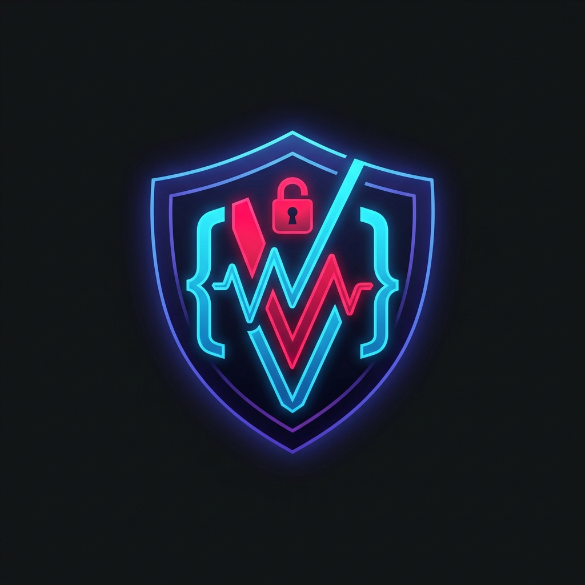

<div align="center">
  

  <br>

  <h1>🛡️ VibeCode Security Inspector</h1>
  
  <p><strong>Stop your AI from shipping vulnerabilities.</strong><br>The first agentic security skill designed specifically to audit "vibe-coded" applications.</p>

  <p>
    <a href="https://github.com/AbhayPatial/vibecode-security-inspector-skill"></a>
    
    
  </p>
</div>

---

## 🛑 The Problem: AI Codes Fast, but Fails at Security
AI assistants (Cursor, Windsurf, Copilot, Claude) are magical for rapid feature development. We call this **"Vibe Coding"**. But underneath the hood, AI consistently hallucinates security fundamentals.

They will:
- ❌ Hardcode your API keys in the client bundle.
- ❌ Bypass database Row-Level Security (RLS).
- ❌ Trust client-submitted prices in Stripe checkouts.
- ❌ Leak massive amounts of database records via React Server Components.

**VibeCode Security Inspector** is a plug-and-play skill that gives your AI assistant the strict ground-truth context it needs to audit its own code and catch these exact patterns *before* you deploy.

---

## ⚡ Supported Platforms

We natively integrate as a "Rule" or "Skill" across all major AI coding environments:

- 🟣 **Cursor** 
- 🌊 **Windsurf**
- 🔵 **Antigravity IDE**
- 🟢 **Codex App**
- 🟠 **Claude Code App**
- 🐙 **GitHub Copilot**
- 🤖 **Gemini CLI**
- ⚡ **Bolt.new & v0.dev**
- ❤️ **Lovable, Replit & StackBlitz**

---

## 🚀 One-Minute Quick Start

### 1️⃣ For IDEs & Desktop Apps (Cursor, Windsurf, Copilot, Antigravity, Codex)
The most robust way to install is to drop the rules directly into your workspace's context folder.

```bash
# 1. Clone the repository into your project
git clone https://github.com/AbhayPatial/vibecode-security-inspector-skill.git

# 2. Copy the inspector into your IDE's specific rules folder:

# For Cursor:
mkdir -p .cursor/rules && cp -r vibecode-security-inspector-skill/vibecode-security-inspector/* .cursor/rules/

# For Windsurf:
mkdir -p .windsurf/rules && cp -r vibecode-security-inspector-skill/vibecode-security-inspector/* .windsurf/rules/

# For GitHub Copilot:
mkdir -p .github && cat vibecode-security-inspector-skill/vibecode-security-inspector/SKILL.md >> .github/copilot-instructions.md

# For Antigravity & Codex (Gemini/OpenAI apps):
mkdir -p .agents/skills && cp -r vibecode-security-inspector-skill/vibecode-security-inspector/ .agents/skills/
```
*(No Git installed? Just click **Code > Download ZIP** on GitHub, extract it, and drag the files into the respective folders above!)*
> **Try it out:** Open your AI chat and type: *"@workspace Run the VibeCode Security Inspector audit on this codebase."*

### 2️⃣ For Terminal CLIs & Agent Apps
If you are using a terminal wrapper (like Claude Code CLI) that supports the `npx skills` command, it is the fastest way:
```bash
npx skills add https://github.com/AbhayPatial/vibecode-security-inspector-skill --skill vibecode-security-inspector
```

**Don't have NPM or Git installed?**
No problem! You can download the `.zip` file directly from GitHub, extract it, and manually drag the `vibecode-security-inspector` folder into your agent's hidden configuration directory (like `.claude/skills/`).

### 3️⃣ For Web-Hosted Vibe Platforms (Bolt.new, Lovable, v0.dev, Replit)
Web-hosted platforms often don't have traditional terminal setups exposed by default.
- **Bolt.new:** Create a `.bolt/prompt` file in your workspace and paste the contents of `SKILL.md` into it.
- **Lovable:** Paste the contents of `SKILL.md` into the "Custom Instructions" or project context settings.
- **v0.dev:** Append the `SKILL.md` contents to your initial prompt when generating data-driven blocks.
- **Replit / CodeSandbox:** Drop the `vibecode-security-inspector` folder into your project root and instruct the AI agent to read `SKILL.md` before making changes.

---

## 🎯 The Vulnerability Hitlist
We aggressively target the blind spots that AI assistants usually miss.

| 🛡️ Audit Category | 🚨 What We Catch |
|-------------------|------------------|
| **Next.js & RSCs** | 🆕 Over-fetched database queries leaking into the DOM, unprotected Server Actions (`"use server"`). |
| **Secrets & Env** | API keys exposed in `NEXT_PUBLIC_` or `VITE_` prefixes, `.env` files committed to Git. |
| **Database Access**| Supabase RLS disabled, missing `WITH CHECK` clauses, Firebase `allow: if true` disasters. |
| **Auth** | Trusting `jwt.decode()`, tokens stored in `localStorage`, lack of server-side validation. |
| **Payments** | Client-submitted prices directly sent to Stripe, missing webhook signature verification. |
| **Mobile Apps** | Expo JS bundle secrets, `AsyncStorage` token leaks, unsafe deep-link parsing. |
| **AI LLM Calls** | Uncapped token usage, missing prompt injection guards, exposed OpenAI keys. |
| **Web-Hosted IDEs**| Public workspace secret leaks, unauthenticated preview URLs exposing admin tools, missing `.gitignore` entries. |

---

## 🧠 How It Works Behind the Scenes
Instead of relying on the AI's standard training data (which is often outdated or contradictory regarding security), the Inspector forces the AI to read from our **curated Markdown reference files**. 

When you trigger a security audit, the AI cross-references your tech stack (e.g., Next.js + Supabase) and only loads the exact security rules tailored for that stack. No bloated context windows, just surgical precision.

---

## 🛠️ Troubleshooting & Skill Activation

If your AI assistant seems to be ignoring the security rules, check these common scenarios:

- **Permission Denied (Windows/Linux):** If `npx skills add` throws an `EPERM` or Execution Policy error on Windows, ensure you have execution policies enabled (`Set-ExecutionPolicy -Scope CurrentUser -ExecutionPolicy RemoteSigned`) or just use the manual ZIP fallback.
- **Cursor / Windsurf Not Reading Rules:** Make sure you copied the *contents* of the folder into `.cursor/rules/` (not just the folder itself). If the AI still hallucinates, explicitly `@` mention the `SKILL.md` file in your prompt to force it into the context window.
- **Copilot Ignorance:** GitHub Copilot relies entirely on `.github/copilot-instructions.md`. Make sure the `SKILL.md` contents were successfully appended to that specific file.
- **Antigravity / Codex (Gemini & OpenAI Apps):** If the skill isn't automatically firing, explicitly prompt the agent with: *"Please strictly follow the security rules located in `.agents/skills/vibecode-security-inspector/SKILL.md` before generating any code."*

---

## 🤝 Join the Movement
We are building the ultimate open-source defense against AI-generated security flaws. If you have discovered a new vulnerability that Cursor, Copilot, or Claude keeps writing, **we want it.**

Please see our [CONTRIBUTING.md](CONTRIBUTING.md) to submit a PR!

<div align="center">
  <br>
  <p>Built for the modern developers by <b>Abhay Patial</b></p>
</div>
